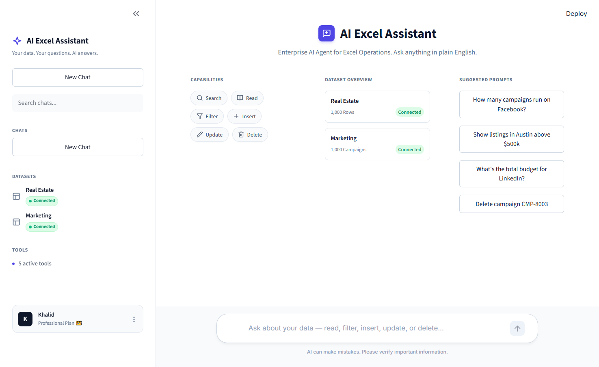

# 📊 AI Excel Assistant

[](https://www.python.org/downloads/)
[](https://streamlit.io/)
[](https://groq.com/)

An enterprise-grade, natural language AI assistant for Excel operations. Built for data analysts and business managers to query, filter, insert, update, and delete spreadsheet data using plain English—powered by a ReAct-based LLM agent.

<p align="center">
  <!-- Place your gorgeous UI screenshot here -->
  
</p>

## ✨ Key Features

*   **Live ReAct Streaming (Premium UI):** A polished Streamlit interface that streams the AI's "thought process" and tool execution live, giving users confidence and transparency into what the agent is doing behind the scenes.
*   **100% Data Governance & Protection:** 
    *   **Strict Slot Filling:** Prevents the LLM from hallucinating missing fields during data insertion.
    *   **Ambiguity Protection:** Refuses to delete data if the user's prompt is ambiguous or could affect multiple rows unexpectedly.
    *   **Categorical Validation:** Enforces strict naming conventions (e.g., mapping "TikTok" to "Social Media") to prevent database schema corruption.
*   **Smart Type Casting:** Robustly handles the common pitfall of LLMs struggling with pandas `dtypes`. Safely casts strings to `datetime` or numeric formats behind the scenes, ensuring zero crashes on complex date or math filters.
*   **Native Pandas Execution:** Operates directly on `.xlsx` files using `pandas`. No heavy SQL databases, ORMs, or complex frameworks required. It's lightweight and lightning fast.

## 📈 Performance & Reliability

The assistant was rigorously evaluated against a suite of 18 challenging data scenarios (spanning Real Estate and Marketing domains), testing its ability to handle edge cases, dates, ambiguous deletes, and schema mapping. 

**Evaluation Results:**
*   **Total Scenarios:** 16
*   **Passed:** 16
*   **Failed:** 0
*   **Overall Accuracy:** `100.0%` 🎉

## 🚀 Quickstart

### Prerequisites
*   Python 3.14+
*   A Groq API Key (for the blazing fast Llama-3.3-70b model).

### Installation

1. **Clone the repository:**
   ```bash
   git clone https://github.com/Khalid7466/ai-excel-assistant.git
   cd ai-excel-assistant
   ```

2. **Install dependencies:**
   We use `uv` for lightning-fast dependency management:
   ```bash
   uv sync
   ```

3. **Environment Setup:**
   Create a `.env` file in the root directory and add your API key:
   ```env
   GROQ_API_KEY=your_api_key_here
   ```

4. **Run the App:**
   ```bash
   uv run streamlit run app.py
   ```

## 🏗 System Architecture

The project is deliberately built *without* heavy agent frameworks (like LangChain or CrewAI) to maintain maximum control, transparency, and minimal token usage.

1.  **UI Layer (`app.py`):** A custom-styled Streamlit app that manages session state, captures user prompts, and renders interactive UI components.
2.  **Agent Core (`agent.py`):** Implements a pure Python ReAct (Reasoning and Acting) loop. It manages the conversation history, calls tools, and parses tool output.
3.  **Tools & Connectors (`tools.py`):** Safe, functional wrappers around Pandas operations (`query_data`, `insert_row`, `update_rows`, `delete_rows`, `get_summary`) equipped with the `Smart Type Caster` to bridge the gap between LLM output and Pandas logic.
4.  **Storage:** Local `.xlsx` files (`real_estate_listings.xlsx`, `marketing_campaigns.xlsx`).

---
*Built with ❤️ for AI Engineering.*
