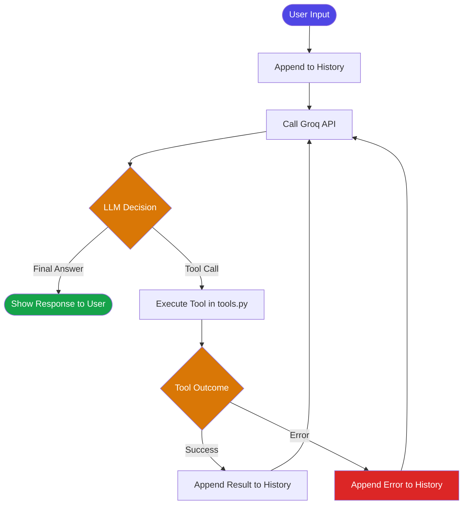

# Agent Query Flow

End-to-end flow of a user query from input to final response.

## Flow Explanation

| Step | Description |
| :--- | :--- |
| **User Input** | User types a natural language query in the Streamlit chat. |
| **History Append** | Message is added to the `conversation_history` list (full context is always sent). |
| **Groq API Call** | The history + System Prompt (with injected schema) + Tools JSON Schema are sent to `llama-3.3-70b-versatile`. |
| **LLM Decision** | The LLM either returns a final text answer OR a structured tool call request. |
| **Tool Execution** | The Python backend parses the tool name and arguments, then calls the matching function in `tools.py`. |
| **Success Path** | The tool result is appended as a `tool` message and the loop restarts — the LLM reads the result and generates a final answer. |
| **Error Path (Ambiguity)** | The `Ambiguity Error` is appended as a `tool` message. The LLM reads it and generates a **clarification question** to the user instead of crashing. |
| **Error Path (Slot Filling)** | The `Missing Fields Error` is appended. The LLM generates a **follow-up question** asking the user to provide the missing data. |
